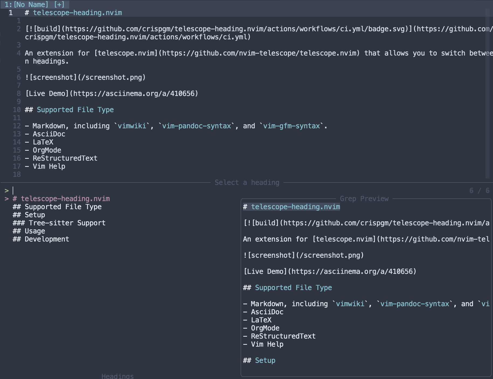

# telescope-heading.nvim

<p align="center">
  
</p>

<p align="center">
  
  
</p>

An extension for [telescope.nvim](https://github.com/nvim-telescope/telescope.nvim) that allows you to switch between document's headings. [Live Demo](https://asciinema.org/a/410656).

## Supported File Types

- Markdown, including `vimwiki`, `vim-pandoc-syntax`, and `vim-gfm-syntax`.
- AsciiDoc
- LaTeX
- OrgMode
- ReStructuredText
- Vim Help

## Setup

Install with your favorite package manager:
```lua
use('nvim-telescope/telescope.nvim')
use('crispgm/telescope-heading.nvim')
```

You can setup the extension by adding the following to your config:
```lua
require('telescope').load_extension('heading')
```

### Tree-sitter Support

telescope-heading supports Tree-sitter for parsing documents and finding headings.

File types with Tree-sitter supports:
- Markdown
- ReStructuredText
- Vim Help

```lua
-- add nvim-treesitter
use('nvim-treesitter/nvim-treesitter')

-- make sure you have already installed treesitter modules
require('nvim-treesitter.configs').setup({
    ensure_installed = {
        -- ..
        'markdown',
        'rst',
        -- ..
    },
})

-- enable treesitter parsing
local telescope = require('telescope')
telescope.setup({
    -- ...
    extensions = {
        heading = {
            treesitter = true,
        },
    },
})

-- `load_extension` must be after `telescope.setup`
telescope.load_extension('heading')
```

If nvim-treesitter is not correctly loaded, it will fallback to normal parsing.

## Usage

```viml
:Telescope heading
```

## Development

Init:

```bash
make init
```

Load telescope-heading locally:

```bash
nvim --noplugin -u scripts/minimal_init.vim ./README.md # replace with /path/to/testfile
# or
make test
```

Lint:

```bash
make lint
```
